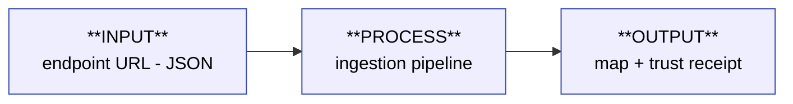

# Payload Lifecycle — the main pipeline

> What happens to a payload, from `endpoint URL` to `pin on the map`.
>
> One linear flow with **one fork**. Every 10 minutes the cron fetches each JSON endpoint, mints `observed_at`, and asks one question — *is it different?* The raw snapshot is **always** kept (SQLite, the trust receipt); the semantic copy is rewritten **only when content changed** (Oxigraph, the map source).
>
> **Rule:** every JSON field declares a *route* through this flow — which step handles it, and where it ends up. A field added later (e.g. `ext_fab.*`) is documented by naming the one step that routes it and the one surface it reaches.

**Two truths, two surfaces, two guarantees:**

| Path | Store | Gated by | Surface | Guarantee |
|---|---|---|---|---|
| **always** | SQLite raw snapshot | — (every fetch) | space-profile card (`/api/space/{id}/raw`) | transparency — verbatim, unaltered |
| **on change** | Oxigraph triples | `content_changed` | map pin (`spaces.geojson`) | freshness — semantic, queryable |

Freshness tokens ride this flow — `observed_at` (minted at fetch, **SQLite**) and `updated_at` (written on change, **Oxigraph**) are the two on the sketch; `open_now` rides alongside. The browser turns these into a map marker; that computation (the three axes + marker allocation) is its own doc: [03 · Freshness axes](../../reference/freshness-axes.md). Lifecycle state is **computed client-side** — never stored on the wire.

<b>Code anchors</b> — where each box lives

- **Fetch › mint** — `fetch_snapshot` writes the raw snapshot to SQLite first, minting `observed_at` (`pipeline.py:43`, `snapshot_store.py:48`).
- **Transform** — `spaceapi_extract` (`extract_core`/`extract_mom`) → idempotent `DELETE WHERE + INSERT DATA` into Oxigraph, only when `content_changed` (`pipeline.py:255`).
- **Materialize** — `_rematerialize_geojson` runs the SPARQL SELECT over claimed spaces → `_binding_to_feature` → `web/data/spaces.geojson` (`main.py:651,737`). Oxigraph is the **only** source the map reads; SQLite is pulled only for `/api/space/{id}/raw` (`main.py:1065`).

---

## How a new field gets routed (the contract)

When `ext_fab.machines` arrives in the JSON later, its documentation is one row:

| Field | Routed by | Lands in (store) | Surfaces as |
|---|---|---|---|
| `ext_fab.machines` | Transform → _which sub-script?_ | Oxigraph predicate `mom:?` | map filter / Bernard card / — |

Filling that row for **every** field is the **[Field Traceability Matrix](../../reference/field-traceability.md)**. The flow above is the skeleton it hangs on.

---

## Triage ledger (classify relative to the trunk)

| Component | Bucket | Note |
|---|---|---|
| `scripts/spaceapi_extract/` (`core`, `mom`, `sparql`, `__init__`) | 🟢 live | P2 · Transform — imported by `pipeline.py`, `main.py`, all three seeders |
| `seed_spaceapi.py`, `seed_bundle.py` | 🟢 live | INPUT — `make seed-spaceapi` / `vps-seed` / `vps-seed-bundle`, staged into container |
| `canary_ops.py`, `load_canary.py` | 🟢 live | canary track — Makefile `CANARY_OPS`/`VPS_OPS` + compose mount + VPS cp twins |
| `canary_scenarios.py` | 🟢 live | canary authoring (`make c-*`), host venv; git stays SSOT |
| `load_ontology.sh` + `test_load_ontology.py` | 🟢 live | ontology bootstrap (loads `mom.ttl`/`iop.ttl`). ⚠️ not wired into Makefile/compose — manual run |
| `validate_crosswalk.py` | 🟢 live | DRC for the net-list — runs green, guards crosswalk integrity |
| `infra/link_handler/{main,pipeline,pipeline_helpers,snapshot_store,utils}.py` | 🟢 live | the runtime engine (P1–P4) |
| `config.yaml`, `Dockerfile`, `conftest.py` | 🟢 live | container + pytest fixtures |
| `test_schema.py`, `test_observed_at_skeleton_e2e.py` | 🟢 live | guard live `main` / the observed_at skeleton |
| `nginx/conf.d/app.conf`, `gateway-nginx/06-09*.conf` | 🟢 live | two-layer nginx (dev stack + VPS gateway) |
| `harness/` (Discord bot) | 🟡 dormant | Epic 6 baseline |
| `scrub_legacy_oxigraph.py` | 🔴 cut (bac3bf2) | migration ran |
| `seed_transition.py` | 🔴 cut (bac3bf2) | back-annotated deprecated bulk-seed files; no caller. NOT the seeded→confirmed flip (that's canary/heartbeat) |
| `seed_import.py` | 🔴 cut | self-declared DEPRECATED (Story 3.4b); bulk-seed path superseded by `seed_spaceapi.py` (`make seed-spaceapi`/`vps-seed`) |
| `normalize_vow.py` + `test_normalize_vow.py` + `category_map.yaml` | 🔴 cut | Epic-0 VOW-scrape generator. Output frozen in `data/archive/moms_seed.json` (still served via `vps-seed-bundle`); generator dead. Nominatim logic recoverable via context7 |
| `materialize_geojson.py` | 🔴 cut | hand-synced duplicate of live `_rematerialize_geojson` (main.py) + `/api/rematerialize`; zero callers, sync-tax removed |
| `canary_pipeline.py` | 🔴 cut | self-declared transitional shim; `main.py` cutover done — only the e2e test imported it. Test repointed at `pipeline.py` directly |
| `validate_dual.py` | 🔴 cut | super-early-draft dual (JSON-LD + SpaceAPI v14) validator; MoM now validates JSON only, `/api/validate-url` (live) is the path. CLI stale + caller-less |

_🟢 on trunk · 🟡 parked ahead of need · 🔴 purpose lost · ❓ needs your intent_

**Triage complete (2026-06-03):** every file in `scripts/` + `infra/` classified against the trunk. Seven cuts this pass (`seed_import`, `normalize_vow`+test+`category_map`, `materialize_geojson`, `canary_pipeline`, `validate_dual`) — each verified zero live producer/consumer before removal.

---

**Trail:** [09](09-seeding-model.md) seeding (how data enters) · **01 pipeline** (how it flows) ·
[02](../../reference/field-traceability.md) field net-list · [08](../../reference/semantic-layer.md) triplestore ·
[03](../../reference/freshness-axes.md) freshness · [04](04-design-rules.md) map grammar ·
[05](05-view-shell.md) drawers · [06](06-space-card.md) card · [07](07-wizard-shell.md) wizard.
