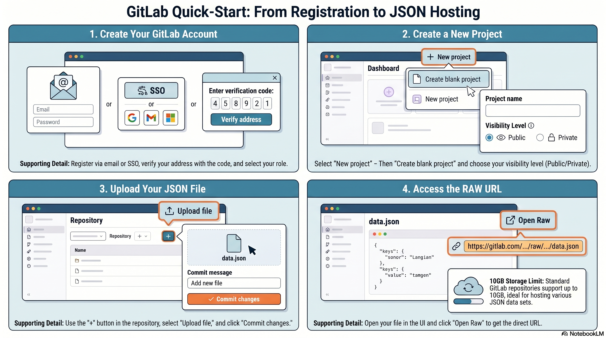
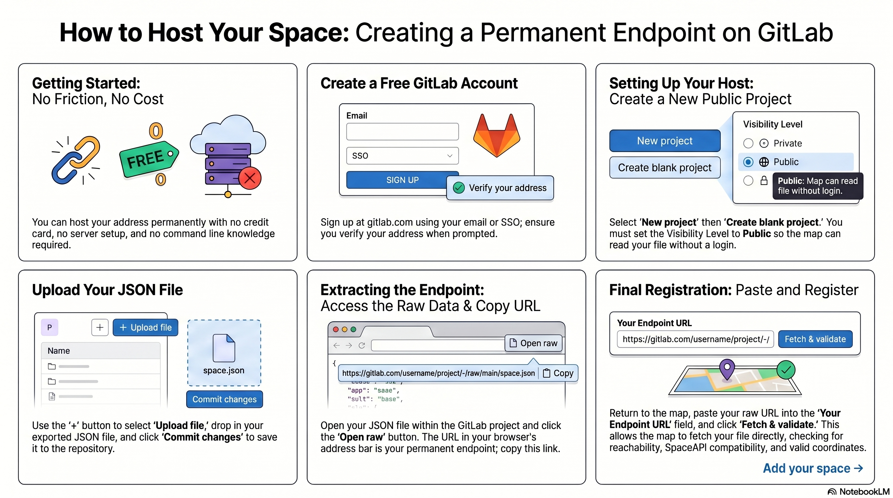

# Publish your first space

A step-by-step walkthrough for putting your makerspace on the map for the first time,
using GitLab as a free, permanent host for your data file. No account beyond GitLab is
needed, no server, no command line.

By the end you'll have a public JSON file describing your space, and a pin on
[mapsofmaking.org](https://mapsofmaking.org/) that updates whenever you edit that file.

> Prefer GitHub Pages, your own website, or another host? See
> [register-your-space.md](../how-to/register-your-space.md) for those options and the
> full field reference. This tutorial is the fastest golden path if you have nothing set
> up yet.

## 1. Create a GitLab account

Go to [gitlab.com](https://gitlab.com) and sign up with an email or SSO (Google,
Microsoft, …). Verify your address with the code GitLab sends you.



## 2. Create a new public project

From the GitLab dashboard: **New project** → **Create blank project**. Give it a name.

**Set Visibility Level to Public.** This is the one step that's easy to miss and the one
that matters most — a private project means Maps of Making can't read your file without
a login, and your space will never appear on the map.

## 3. Write your space file

Create a file named `space.json` (or `spaceapi.json`) at the root of the project.
Start from the minimal example in
[register-your-space.md](../how-to/register-your-space.md#what-goes-in-the-json):

```json
{
  "api_compatibility": ["15"],
  "space": "Example Space",
  "url": "https://example.org",
  "location": {
    "lat": 50.8503,
    "lon": 4.3517,
    "address": "Rue de l'Exemple 12, 1000 Brussels, Belgium",
    "country_code": "BE"
  },
  "state": { "open": null },
  "contact": { "email": "contact@example.org" }
}
```

In the GitLab repository view: the **+** button → **Upload file** → select your JSON →
write a commit message (e.g. "Add space file") → **Commit changes**.

## 4. Get the raw URL

Open your committed file in GitLab's file viewer and click **Open raw** (or **Open Raw**
in older UIs). The URL in your browser's address bar —
`https://gitlab.com/<username>/<project>/-/raw/main/space.json` — is your permanent,
public endpoint. Copy it.



## 5. Register on the map

Back on [mapsofmaking.org](https://mapsofmaking.org/), open the **"Add your space"**
drawer, paste your raw URL, and click **Fetch & validate**. Maps of Making fetches your
file directly and checks reachability, SpaceAPI compatibility, and that your coordinates
are valid numbers.

If validation passes, your space appears on the map immediately.

## What's next

- Edit `space.json` any time — GitLab commits are picked up on the next heartbeat cycle
  (within 10 minutes), no re-registration needed.
- Add more fields (`opening_hours`, `knowsAbout`, `memberOf`, …) to unlock the full detail
  card — see the field table in
  [register-your-space.md](../how-to/register-your-space.md#what-goes-in-the-json).
- Hit an error? Check [Common pitfalls](../how-to/register-your-space.md#common-pitfalls).
